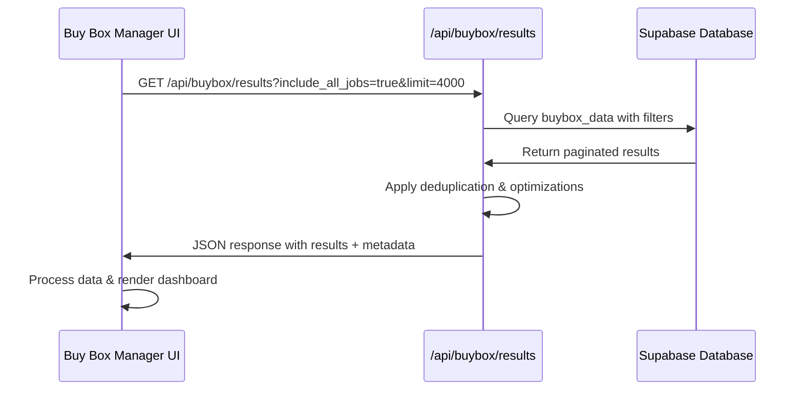

# Buy Box Manager (+page.svelte) - Comprehensive Analysis & Review

## Executive Summary

The Buy Box Manager is a sophisticated SvelteKit-based dashboard for monitoring and analyzing Amazon Buy Box performance. It connects to a comprehensive backend system that collects, processes, and analyzes Amazon marketplace data to provide actionable insights for pricing optimization.

## Architecture Overview

### Frontend Layer (SvelteKit)
- **Main Component**: `/src/routes/buy-box-manager/+page.svelte`
- **Purpose**: Display buy box data with advanced filtering, pagination, and analysis
- **Framework**: SvelteKit with TypeScript
- **Styling**: Tailwind CSS

### Backend API Layer
- **Primary API**: `/src/routes/api/buybox/results/+server.ts` 
- **Supporting APIs**: 
  - `/src/routes/api/buybox/jobs/+server.ts` (job management)
  - `/src/routes/api/buybox/full-scan/+server.ts` (scan trigger)
  - `/src/routes/api/buy-box-monitor/search/+server.ts` (product search)

### Database Layer (Supabase PostgreSQL)
- **Core Tables**: `buybox_data`, `buybox_jobs`, `buybox_failures`
- **Supporting Tables**: `sku_asin_mapping`
- **Client**: Supabase Admin client with service role key

## Data Flow Analysis

### 1. Data Collection Process

```mermaid
graph TD
    A[Scheduled Job/Manual Trigger] --> B[/api/buybox/full-scan]
    B --> C[Retrieve Active ASINs from sku_asin_mapping]
    C --> D[Rate-Limited Amazon SP-API Calls]
    D --> E[Store Results in buybox_data]
    E --> F[Update Job Status in buybox_jobs]
    F --> G[Log Failures in buybox_failures]
```

**Key Components:**
- **Rate Limiting**: 1 request/second + jitter (0-400ms)
- **Retry Logic**: Up to 3 attempts with exponential backoff
- **Job Tracking**: Complete audit trail in `buybox_jobs` table
- **Error Handling**: Detailed failure logging in `buybox_failures`

### 2. Data Processing & Enhancement

The system performs extensive margin analysis and cost calculations:

#### Cost Structure Analysis
```typescript
interface CostBreakdown {
  your_cost: number;                    // Base product cost
  your_shipping_cost: number;           // Shipping costs
  your_material_total_cost: number;     // Material costs
  your_box_cost: number;               // Packaging costs
  your_vat_amount: number;             // VAT calculations
  your_fragile_charge: number;         // Fragile item fees
  material_cost_only: number;          // Pure material costs
  total_operating_cost: number;        // Sum of all fixed costs
}
```

#### Profit Calculations
```typescript
interface ProfitAnalysis {
  current_actual_profit: number;       // Profit at current price
  buybox_actual_profit: number;        // Profit if matching buy box
  your_margin_at_current_price: number;
  your_margin_percent_at_current_price: number;
  margin_at_buybox_price: number;
  margin_percent_at_buybox_price: number;
  margin_difference: number;           // Profit difference
  profit_opportunity: number;          // Potential gain
  break_even_price: number;           // Minimum viable price
}
```

### 3. Frontend Data Flow



## Database Schema Deep Dive

### Core Table: `buybox_data`

```sql
CREATE TABLE buybox_data (
    -- Primary identification
    id UUID PRIMARY KEY,
    run_id UUID,                    -- Links to buybox_jobs
    asin TEXT NOT NULL,
    sku TEXT NOT NULL,
    
    -- Pricing data
    price NUMERIC(10,2),            -- Buy box price (competitor)
    your_current_price NUMERIC(10,2), -- Our listed price
    competitor_price NUMERIC(10,2),
    
    -- Status flags
    is_winner BOOLEAN,              -- Are we winning buy box?
    opportunity_flag BOOLEAN,       -- Profitable opportunity exists?
    
    -- Enhanced cost analysis (new fields)
    your_cost NUMERIC(10,2),
    your_shipping_cost NUMERIC(10,2),
    your_material_total_cost NUMERIC(10,2),
    your_box_cost NUMERIC(10,2),
    your_vat_amount NUMERIC(10,2),
    your_fragile_charge NUMERIC(10,2),
    material_cost_only NUMERIC(10,2),
    total_operating_cost NUMERIC(10,2),
    
    -- Margin calculations
    your_margin_at_current_price NUMERIC(10,2),
    your_margin_percent_at_current_price NUMERIC(10,2),
    margin_at_buybox_price NUMERIC(10,2),
    margin_percent_at_buybox_price NUMERIC(10,2),
    margin_difference NUMERIC(10,2),
    profit_opportunity NUMERIC(10,2),
    
    -- Profit analysis
    current_actual_profit NUMERIC(10,2),
    buybox_actual_profit NUMERIC(10,2),
    current_profit_breakdown TEXT,
    buybox_profit_breakdown TEXT,
    
    -- Recommendations
    recommended_action TEXT,        -- 'match_buybox', 'hold_price', 'not_profitable', 'investigate'
    price_adjustment_needed NUMERIC(10,2),
    break_even_price NUMERIC(10,2),
    
    -- Metadata
    margin_calculation_version TEXT,
    cost_data_source TEXT,
    captured_at TIMESTAMP DEFAULT NOW()
);
```

### Supporting Table: `buybox_jobs`

```sql
CREATE TABLE buybox_jobs (
    id UUID PRIMARY KEY,
    status TEXT CHECK (status IN ('running', 'completed', 'failed')),
    started_at TIMESTAMP DEFAULT NOW(),
    completed_at TIMESTAMP,
    total_asins INTEGER DEFAULT 0,
    successful_asins INTEGER DEFAULT 0,
    failed_asins INTEGER DEFAULT 0,
    notes TEXT,
    duration_seconds INTEGER,
    source TEXT DEFAULT 'scheduled',
    rate_limit_per_second INTEGER DEFAULT 1,
    jitter_ms INTEGER DEFAULT 400,
    max_retries INTEGER DEFAULT 3
);
```

## Component Analysis: Buy Box Manager Frontend

### State Management

The component manages complex state across multiple dimensions:

```typescript
// Core data arrays
let buyboxData: BuyBoxData[] = [];        // Main dataset
let filteredData: BuyBoxData[] = [];      // Post-filter dataset  
let allRawData: BuyBoxData[] = [];        // Historical data store

// UI state
let isLoading = true;
let errorMessage = '';
let currentPage = 1;
let itemsPerPage = 50;

// Filter state
let searchQuery = '';
let categoryFilter = 'all';
let sortBy = 'profit_desc';
let showOnlyWithMarginData = false;
let includeNoMarginData = false;
let minProfitFilter = 0;
let minMarginFilter = 0;
let showLatestOnly = true;
```

### Key Functions

#### 1. Data Loading (`loadBuyBoxData`)
- Handles large dataset fetching with retry logic
- Implements automatic fallback for oversized responses
- Comprehensive error handling and user feedback
- Memory usage monitoring and optimization

```typescript
async function loadBuyBoxData(retryLimit: number | null = null): Promise<void> {
    // Request tracking and performance monitoring
    const requestStartTime = Date.now();
    const requestId = generateRequestId();
    
    // Automatic retry with reduced limits for large datasets
    if (data.errorType === 'Function.ResponseSizeTooLarge' && !retryLimit) {
        setTimeout(() => {
            loadBuyBoxData(data.autoRetryWith);
        }, 1500);
        return;
    }
    
    // Data deduplication and processing
    buyboxData = data.results;
    if (showLatestOnly) {
        buyboxData = deduplicateLatestData(buyboxData);
    }
}
```

#### 2. Data Deduplication (`deduplicateLatestData`)
- Ensures only latest scan per SKU is shown
- Sorts by timestamp to maintain data integrity
- Optimizes performance by reducing duplicate records

#### 3. Advanced Filtering (`applyFilters`)
- Multi-dimensional filtering: text search, category, profit, margin
- Performance optimizations with base cost filtering
- Real-time filter application with proper state management

```typescript
function applyFilters(): void {
    let filtered = [...buyboxData];
    
    // Text search across SKU, ASIN, product title
    if (searchQuery.trim()) {
        filtered = filtered.filter(item => 
            item.sku.toLowerCase().includes(query) ||
            item.asin.toLowerCase().includes(query) ||
            item.product_title?.toLowerCase().includes(query)
        );
    }
    
    // Category-based filtering with business logic
    switch (categoryFilter) {
        case 'winners': filtered = filtered.filter(item => item.is_winner); break;
        case 'opportunities': filtered = filtered.filter(item => item.opportunity_flag); break;
        case 'profitable': filtered = filtered.filter(item => 
            item.profit_opportunity && item.profit_opportunity > 0); break;
        // ... additional cases
    }
    
    // Cost data validation (critical for accurate profit calculations)
    filtered = filtered.filter(item => 
        item.your_cost !== null && item.your_cost > 0
    );
}
```

### UI Features & User Experience

#### 1. Smart Data Loading
- **Optimized by default**: Excludes records without cost data
- **Progressive loading**: Automatic retry with reduced limits
- **User control**: Toggle between optimized and complete datasets
- **Real-time feedback**: Loading states, error messages, data freshness alerts

#### 2. Advanced Filtering System
```html
<!-- Category-based filtering -->
<select bind:value={categoryFilter}>
    <option value="all">All Products</option>
    <option value="winners">🏆 Buy Box Winners</option>
    <option value="losers">❌ Not Winning</option>
    <option value="opportunities">⚡ Opportunities</option>
    <option value="profitable">💰 Profitable Ops</option>
    <optgroup label="Recommendations">
        <option value="match_buybox">🎯 Match Buy Box</option>
        <option value="hold_price">✋ Hold Price</option>
        <option value="not_profitable">🚫 Not Profitable</option>
        <option value="investigate">🔍 Investigate</option>
    </optgroup>
</select>
```

#### 3. Comprehensive Data Display
- **Product Information**: Title, SKU, ASIN with direct links
- **Price Analysis**: Current vs. buy box pricing with gaps
- **Cost Breakdown**: Detailed cost structure analysis
- **Margin Analysis**: Profit calculations and opportunities
- **Recommendations**: AI-driven action suggestions
- **Actions**: Quick access to live pricing, comparisons, updates

#### 4. Performance Optimizations
- **Pagination**: Configurable items per page (25-200)
- **Batch fetching**: For large datasets (>1000 records)
- **Response size monitoring**: Automatic fallback for oversized responses
- **Memory management**: Cleanup and optimization tracking

## Integration Points

### 1. Amazon SP-API Integration
- **Rate limiting**: 1 request/second + jitter for compliance
- **Error handling**: Comprehensive retry logic for 429/503/500 errors
- **Data validation**: Ensures data integrity and consistency

### 2. Make.com Integration
- **Scheduled triggers**: Automated scanning at regular intervals
- **Manual triggers**: On-demand scanning capabilities
- **Status reporting**: Job completion and failure notifications

### 3. Supabase Integration
- **Real-time data**: Direct database queries with optimizations
- **Security**: Service role key for admin operations
- **Performance**: Indexed queries and optimized data structures

## Business Logic & Calculations

### 1. Profit Opportunity Detection
```typescript
// Simplified logic
const amazonFeeRate = 0.15; // 15% Amazon fee
const totalCostAfterFees = total_operating_cost + (price * amazonFeeRate);
const potentialProfit = buyboxPrice - totalCostAfterFees;
const isOpportunity = potentialProfit > minimumMarginThreshold;
```

### 2. Recommendation Engine
- **match_buybox**: Profitable to match competitor price
- **hold_price**: Current position is optimal
- **not_profitable**: No profitable pricing option available
- **investigate**: Insufficient data or anomalous conditions

### 3. Margin Analysis
- **Current margin**: Profit at existing price point
- **Buy box margin**: Potential profit if matching buy box
- **Break-even analysis**: Minimum viable pricing
- **Opportunity quantification**: Specific profit potential

## Performance Considerations

### 1. Data Volume Management
- **Typical dataset**: 10,000-50,000 records
- **Response size limits**: 6MB maximum per request
- **Optimization strategies**: 
  - Filter out records without cost data (reduces ~50-70%)
  - Deduplication (latest data only)
  - Batch processing for large requests

### 2. Query Optimization
- **Database indexes**: Optimized for common filter patterns
- **API pagination**: Configurable limits with batch fallback
- **Caching strategies**: Fresh data prioritization with staleness alerts

### 3. User Experience
- **Progressive loading**: Immediate feedback with loading states
- **Error recovery**: Automatic retry with user notification
- **Data freshness**: Visual indicators for stale data

## Error Handling & Recovery

### 1. API Level
- **Response size errors**: Automatic retry with reduced limits
- **Timeout handling**: 30-second timeout with user feedback
- **Rate limit compliance**: Built-in throttling and retry logic

### 2. Data Level
- **Missing cost data**: Automatic filtering with user notification
- **Stale data**: Visual warnings for data older than 24 hours
- **Incomplete records**: Graceful handling of partial data

### 3. User Level
- **Clear error messages**: Actionable feedback for users
- **Recovery suggestions**: Specific steps to resolve issues
- **Alternative options**: Fallback strategies for data access

## Future Enhancement Opportunities

### 1. Real-time Features
- **Live price monitoring**: WebSocket connections for real-time updates
- **Alert system**: Notifications for significant price changes
- **Automated repricing**: Integration with Amazon's pricing APIs

### 2. Advanced Analytics
- **Trend analysis**: Historical performance tracking
- **Predictive modeling**: Price optimization recommendations
- **Competitive intelligence**: Market position analysis

### 3. Workflow Automation
- **Bulk actions**: Mass price updates and monitoring toggles
- **Approval workflows**: Multi-step price change processes
- **Integration expansion**: Additional marketplace support

## Security & Compliance

### 1. Data Protection
- **Service role authentication**: Secure Supabase access
- **Rate limit compliance**: Amazon API terms adherence
- **Data encryption**: Secure transmission and storage

### 2. Access Control
- **Admin-level operations**: Restricted to service role
- **User permissions**: Role-based access control ready
- **Audit trails**: Complete operation logging

## Conclusion

The Buy Box Manager represents a sophisticated, production-ready system for Amazon marketplace monitoring and optimization. Its architecture balances performance, usability, and scalability while providing comprehensive business insights through advanced data analysis and intelligent recommendations.

The system's strength lies in its robust error handling, performance optimizations, and user-centric design, making it suitable for managing large-scale Amazon operations with confidence and efficiency.
